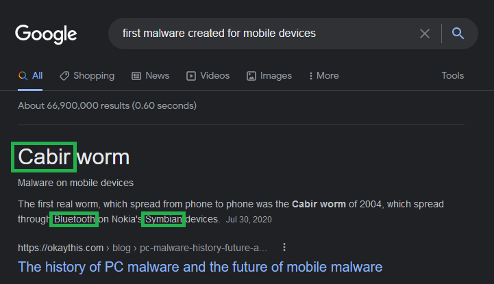
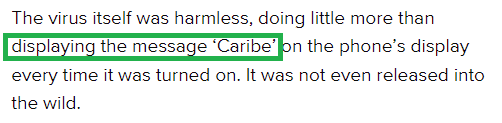

# Week 5 Lab: Mobile Malware Analysis \[THM\]

## Task 1: Introduction
Mobile devices are just as powerful as PCs and just as vulnerable too. We’re gonna learn about securing our mobile devices and how to analyze malware.

## Task 2: An Unknown Land
This task focuses on researching mobile malware. I used google to answer the questions.

**What is known as the first malware created to affect mobile devices?**    Cabir
**What technology does this worm use to multiply?**    Bluetooth
**What operating system did it infect?**    Symbian
I clicked the link to see if the message was discussed. 

**What message did it show on the screen of the infected mobile phone?**    Caribe
Task Completed!

## Task 3: Small Size, A Lot Of Destruction.

## Task 4: Digging Deeper

## Task 5: MobSFing The Sample

## Task 6: It Doesn't Smell Good!

## Task 7: Conclusion
I now have a better understanding of what can be exploited on mobile devices with more sources to dig even deeper.

Room Completed!

[Back to Home](index.html)
